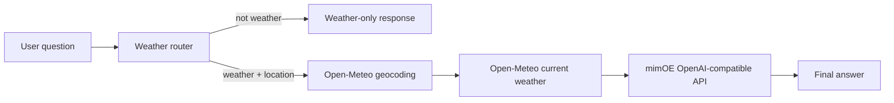

# mimOE Local Weather Agent

A small weather-only AI agent built for the mimOE BYO Framework assignment. It runs inference through the OpenAI-compatible endpoint exposed by mimOE Studio while obtaining current, factual weather observations from Open-Meteo.

## Objective

The agent answers current-weather questions such as:

```text
What is the weather in Vancouver?
Will it rain in Toronto today?
What is the temperature near London?
```

For an unrelated question, it replies:

```text
I can only answer weather questions.
```

## Why this approach

I chose raw Python HTTP calls instead of LangChain, CrewAI, or another agent framework. The assignment asks for the simplest BYO Framework path, and the standard library keeps every connection visible:

1. A deterministic router accepts only weather-related questions.
2. The location is extracted from the question.
3. Open-Meteo geocodes the location and returns current conditions.
4. The observation is sent to the local mimOE `/chat/completions` endpoint.
5. The locally loaded model turns the structured observation into a concise answer.

This separates factual data retrieval from language generation. The model does not need to know live weather and is explicitly instructed not to invent data.



## Requirements

- Python 3.9 or newer
- mimOE Studio running
- A model loaded in mimOE Model View
- Internet access for Open-Meteo weather data

No third-party Python packages are required.

## Configuration

Open mimOE Studio, go to **AI Models**, load a model, and select **API**. Use the values shown there.

For the machine used during development:

```bash
export MIMIK_BASE_URL="http://192.168.0.120:8083/mimik-ai/openai/v1"
export MIMIK_API_KEY="1234"
export MIMIK_MODEL="smollm-360m"
```

These are also the development defaults in the code for a quick demonstration. Environment variables override them. A different LAN address may be assigned after changing networks, so copy the current URL from mimOE Studio before running.

## Run

Interactive mode:

```bash
python3 -B main.py
```

One question:

```bash
python3 -B main.py "What is the weather in Vancouver?"
```

Example session:

```text
mimOE Weather Agent (type 'quit' to exit)
You: What is the weather in Vancouver?
Agent: Vancouver is currently 18 C with light cloud and no precipitation.
You: Who wrote Hamlet?
Agent: I can only answer weather questions.
```

Exact wording varies because the final response is generated by the local model.

## Test

```bash
python3 -B -m unittest -v
```

The tests use realistic HTTP responses without calling external services. They verify routing, missing-location behavior, weather lookup, and the exact OpenAI-compatible request sent to mimOE.

### Continuous integration

GitHub Actions runs the unit tests on Python 3.9 and the latest supported Python version for every pull request to `main` and every push to `main`. The workflow is defined in `.github/workflows/tests.yml`.

To prevent merging when tests fail, enable a ruleset or branch protection rule for `main` in GitHub and require these status checks:

```text
Unit tests (Python 3.9)
Unit tests (Python 3.13)
```

GitHub only offers a check in the required-checks list after the workflow has run at least once.

## Design notes

- **Raw API calls:** less setup and a smaller dependency surface than a framework for this focused workflow.
- **OpenAI compatibility:** the request uses `POST /chat/completions`, bearer authentication, a model ID, and standard `messages`.
- **Deterministic guardrail:** non-weather questions are rejected before any network or model call.
- **Grounding:** current observations come from Open-Meteo; mimOE only phrases the answer.
- **Output validation:** if the small local model adds an unsupported provider, omits the measured temperature, or produces an overlong answer, the agent uses a deterministic summary of the same observation.
- **Testability:** the HTTP opener is injectable, so component boundaries are tested without test-only production APIs.

## Limitations and next steps

- Location extraction intentionally handles simple English phrasing; a production version should use structured model output or a geospatial parser.
- The current version reports current conditions, not a multi-day forecast.
- Open-Meteo requires internet access, although model inference remains entirely local.
- The development API key is suitable only for this local demonstration. A real deployment should use a rotated secret and restrict network exposure.
